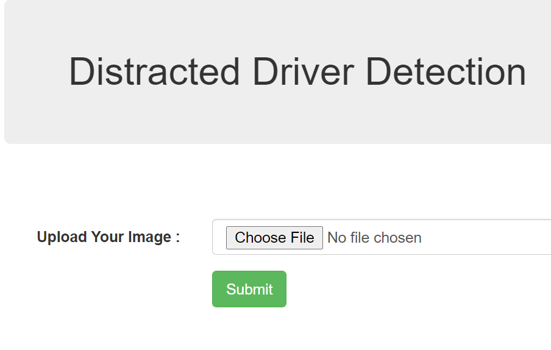
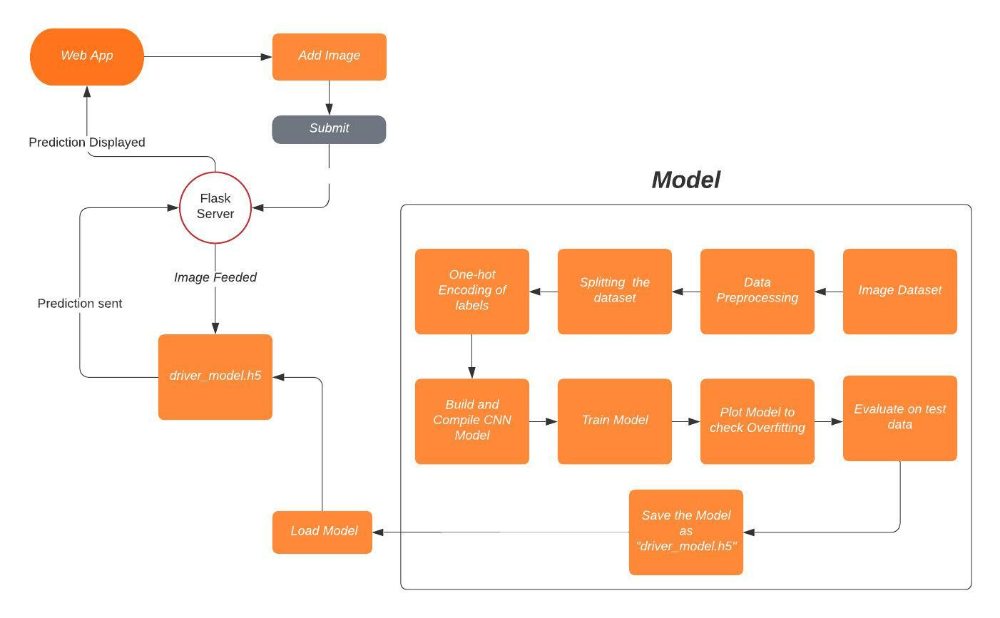

## Distracted Driver Detection
The objective of this project is to succesfully predict what the driver is doing in the pictures into the given 10 labels.

Some examples of the images:

The images are labeled following a set of 10 categories:

|Class|Description|
|-----|-----------|
| `c0` | Safe driving. |
| `c1` | Texting (right hand). |
| `c2` | Talking on the phone (right hand). |
| `c3` | Texting (left hand). |
| `c4` | Talking on the phone (left hand). |
| `c5` | Operating the radio. |
| `c6` | Drinking. |
| `c7` | Reaching behind. |
| `c8` | Hair and makeup. |
| `c9` | Talking to passenger(s). |

## Dependencies
    Flask==2.0.1
    numpy==1.19.4
    Pillow==8.2.0
    tensorflow-cpu==2.6.0
    gunicorn==20.1.0

## Live Link on Heroku
[Link](https://myflaskone.herokuapp.com/)

## Input / Output Screenshots
 

## Methodology 

